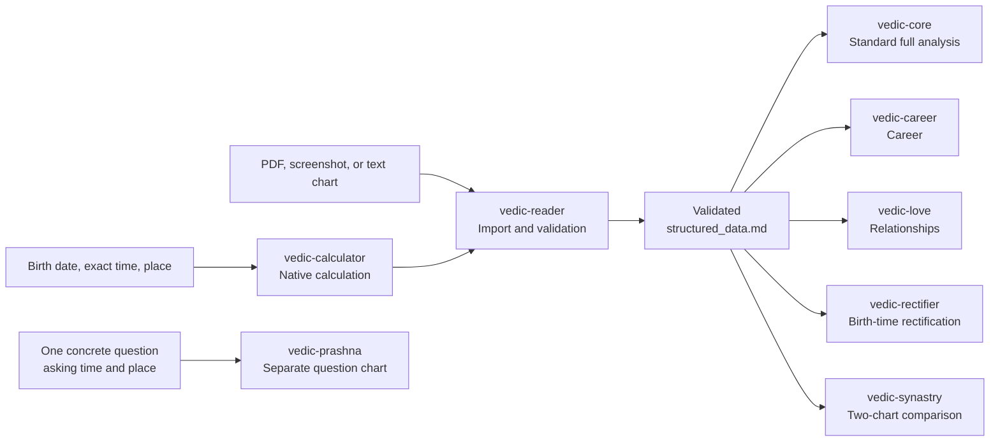

<p align="center">
  <h1 align="center">🔱 Vedic Astro Skills v8.0</h1>
  <p align="center"><strong>Calculate a Vedic chart from birth details and continue directly to full analysis</strong></p>
  <p align="center">
    <sub>从出生信息直接排盘，进入完整吠陀占星分析<br>
    出生情報から出生図を直接計算し、そのまま総合分析へ</sub>
  </p>
  <p align="center">
    <a href="CHANGELOG.md"></a>
    <a href="#python-environment"></a>
    <a href="#-the-eight-skills"></a>
    <a href="#-license-and-scope"></a>
  </p>
</p>

<p align="center">
  🌐 <a href="README.md"><strong>简体中文</strong></a> ·
  <strong>English documentation</strong> ·
  <a href="README.ja.md"><strong>日本語ドキュメント</strong></a>
</p>

---

> **Eight specialized skills work together from direct birth-chart calculation through validation, complete natal analysis, career, relationships, birth-time rectification, synastry, and Prashna.**
>
> Compatible with Codex, Claude Code, and any client that reads the Claude Skill format (Antigravity, various China-market agents, and others). PDFs, screenshots, and text charts are optional import routes, not prerequisites.

<details>
<summary><strong>📖 Open table of contents</strong></summary>

- [What this suite does](#-what-this-suite-does)
- [Workflow](#-workflow)
- [The eight skills](#-the-eight-skills)
- [Skill details](#-skill-details)
- [Technical architecture and data integrity](#-technical-architecture-and-data-integrity)
- [Installation](#-installation)
- [Quick start](#-quick-start)
- [Recommended Codex patch](#-recommended-codex-patch)
- [Language behavior](#-language-behavior)
- [Repository layout and updates](#-repository-layout-and-updates)
- [Version history](#-version-history)
- [License and scope](#-license-and-scope)

</details>

## ✨ What this suite does

This is not merely a prompt collection for interpreting an existing PDF. The primary workflow
starts from birth details:

1. Provide a birth date, exact time, and place.
2. `vedic-calculator` calculates a complete Vedic chart.
3. `vedic-reader` validates the data, assesses time uncertainty, and runs pre-validation.
4. The workflow produces one canonical `structured_data.md`.
5. Continue into a full natal analysis, career, relationships, birth-time rectification, or
   two-person synastry.

JHora PDFs, screenshots, and text exports are also supported. They can be imported and checked
against the calculated chart, but they are optional. **Direct calculation followed by full
analysis is the main entry point.**

The suite provides:

- native chart calculation without requiring a third-party chart website or prebuilt PDF;
- one validated data contract shared by the natal-analysis modules;
- P1-P12 planet audit, divisional cross-checks, twelve-house diagnostics, ten life areas,
  and a technical appendix;
- dedicated career, relationship, rectification, and four-frame synastry workflows;
- complete Vimshottari MD/AD/PD timelines and input-time stability audits;
- a separate Prashna question-time chart that does not mix with the natal pipeline;
- client-facing Chinese, English, and Japanese chat, intake, reports, Q&A, and HTML shells;
- parity-checked canonical `skills/` plus Claude Code and Codex distributions.

## 🔄 Workflow



All natal modules consume the same validated `structured_data.md`. `vedic-prashna` instead uses
its own `structured_prashna.md` and output directory. It does not automatically import natal
Dasha, divisional charts, or SAV into a Prashna judgment.

## 🧩 The eight skills

| Skill | Primary input | Responsibility | Main artifact |
|---|---|---|---|
| [`vedic-calculator`](skills/vedic-calculator/SKILL.md) | Birth date, exact time, place | Calculate a complete Vedic chart and timeline | `structured_data.md` |
| [`vedic-reader`](skills/vedic-reader/SKILL.md) | Calculated data or PDF/image/text | Extract, normalize, run 16 checks, pre-validate, and route | Validated `structured_data.md` |
| [`vedic-core`](skills/vedic-core/SKILL.md) | Validated natal data | Standard full natal audit and ten-area analysis | Staged Markdown, appendix, HTML |
| [`vedic-career`](skills/vedic-career/SKILL.md) | Validated natal data | Career niche, strengths, D9/D10, and timing | Profile, strategy, and risk reports |
| [`vedic-love`](skills/vedic-love/SKILL.md) | Validated natal data | Relationship patterns, capacity, and timing | Pattern, timing, and guidance reports |
| [`vedic-rectifier`](skills/vedic-rectifier/SKILL.md) | Uncertain time, events, traits | Compare time candidates with event and structural evidence | Rectification audit and conclusion |
| [`vedic-synastry`](skills/vedic-synastry/SKILL.md) | One validated chart per person | Neutral scan, directional overlay, capacity, and shared timing | `synastry_data.md` and layered reports |
| [`vedic-prashna`](skills/vedic-prashna/SKILL.md) | One question, asking time, place | Cast a separate question-time chart and apply an auditable rule ledger | `structured_prashna.md` and judgment |

Installing all eight skills is recommended. At runtime, only the module required for the current
task is selected; the workflows are not all loaded at once.

## 🔍 Skill details

<details>
<summary><strong>🧮 vedic-calculator: calculate directly from birth details</strong></summary>

`vedic-calculator` is the computational foundation of the natal pipeline. From date, exact time,
coordinates, and an IANA timezone, it creates the canonical `structured_data.md`.

It outputs:

- Lagna and nine Grahas with longitude, house, retrograde status, Nakshatra, and Pada;
- 7K primary and 8K reference Chara Karaka tables;
- D1, D9, D10, D4, D5, and additional divisional charts, totaling 15 charts from D1 to D60;
- Shadbala, Ishta/Kashta Phala, SAV, and BAV;
- house lords, Compound Dignity, Graha Drishti, combustion, Moon phase, AL, and UL;
- the complete Vimshottari timeline: 9 MD, 81 AD, and 729 PD periods;
- current transits, Sade Sati, double transits, and divisional-boundary sensitivity.

The calculator always computes and validates the complete timeline. Downstream modules use
`dasha_query.py` to retrieve only the relevant PD windows. This avoids flooding model context
with 729 rows and prevents selective drill-down on only a favored interpretation.

An optional `xiaohuo-person-v1` plain-text export is available for users who explicitly request
a Xiaohuo person card. It does not replace or modify the canonical chart data.

</details>

<details>
<summary><strong>📖 vedic-reader: import, validate, and pre-validate</strong></summary>

`vedic-reader` supports two entry routes:

- Calc route: consume `structured_data.md` produced by the calculator.
- File route: extract birth details from a PDF, screenshot, or text export, then calculate the
  canonical chart.

PDF and image data are used for extraction and cross-validation, not arbitrary replacement of
calculated fields. Shadbala always retains the calc baseline. A valid JHora PDF for the same birth
time may be compared row by row, with any differences shown explicitly.

The Reader runs the full 16-rule validation system, including SAV/BAV constants, planet
completeness, Rahu-Ketu opposition, retrograde markers, combustion, planetary war, Ayanamsa,
Nakshatra, Chara Karaka ordering, MD/AD/PD continuity, D9 formula checks, and divisional-node
rules. It treats record-source reliability and mathematical divisional stability as separate
questions.

After validation, the Reader performs signal triage, Yoga scanning, and pre-validation before
routing into the full core or a topic module.

</details>

<details>
<summary><strong>🔬 vedic-core: standard full natal analysis</strong></summary>

The public repository includes the Standard `vedic-core`. It creates staged, auditable artifacts
rather than generating one undifferentiated essay:

1. identity overview and P1-P12 planet audit;
2. Yoga prescan, PAC synthesis, and Rahu/Ketu node audit;
3. deep D9 review with D10, D4, and D5 cross-checks;
4. all twelve houses, Parivartana, and Badhaka diagnostics;
5. Dasha review, Yoga activation, and ten life areas;
6. P1-P12 parameters, divisional data, validation, and timeline appendices;
7. report packaging and post-completion Q&A.

Technical files retain the parameters, counterevidence, and audit trail. The ten-area section is
the primary client-facing narrative. Neither layer replaces the other.

</details>

<details>
<summary><strong>💼 vedic-career: direction, role fit, and timing</strong></summary>

The career workflow runs four phases: workplace niche, talent/Yoga scan, D9 deep audit, and full
synthesis. It combines D1, D9, D10, and Dasha to distinguish what the person is good at, which
roles fit, which working environments are supportive, and what career phase is active. Its final
artifacts cover profile, strategy, and risks rather than merely listing occupations.

</details>

<details>
<summary><strong>💘 vedic-love: relationship patterns and timing</strong></summary>

The relationship workflow first assesses natal emotional patterns, needs, and partnership
capacity. It then identifies timing windows through Dasha and relationship indicators, followed
by transit-based qualification of those windows. It uses Vedic factors such as the 5th and 7th
houses, Venus, Moon, PK/DK, UL, and D9, while keeping supporting and limiting evidence visible.

</details>

<details>
<summary><strong>📐 vedic-rectifier: birth-time rectification</strong></summary>

Rectification is intended for an uncertain, approximate, or possibly misrecorded birth time. The
standard entry uses five or more major life events together with personal traits, Dasha timelines,
D1/D9/D10 transitions, and minute-by-minute astronomical calculation.

The workflow first audits the source and meaning of the reported time, then defines the search
interval. It compares all candidates instead of validating only a preferred time. The result keeps
the raw-score leader, current best estimate, confirmed layer, and time confidence separate. A
borderline or underdetermined case does not receive invented minute-level precision.

</details>

<details>
<summary><strong>💞 vedic-synastry: two-person chart comparison</strong></summary>

Synastry requires one validated `structured_data.md` per person. It begins with a relationship-
neutral signal scan. The user can then stop at the nature scan, choose a general deep analysis, or
select one of four explicit frames: romantic, business, friendship, or family.

The workflow audits each person's capacity, applies Ashtakoota as a lunar-mansion screening layer,
calculates directional house overlays and Graha Drishti, and compares relationship timing. The
final six dimensions are emotional safety, attraction, communication repair, long-term capacity,
practical cooperation, and current timing. It does not collapse these into a single compatibility
percentage or infer the real-world relationship type from the chart.

</details>

<details>
<summary><strong>🔮 vedic-prashna: separate question-time chart</strong></summary>

Prashna accepts one concrete, observable question and casts a chart for the exact asking time and
place. The default standard layer is rooted in *Shatpanchasika* and compatibility-screened against
KN Rao/Bharatiya Vidya Bhavan practice. It shows an auditable rule ledger and reaches one of three
directions: supported, unresolved, or unsupported at present.

The current standard layer does not claim production-grade event dates and does not treat a Moon
without contact as an automatic denial. Tajika contact analysis and KP 1-249 are off-by-default,
file-isolated optional stacks that never vote with the standard judgment. Both remain explicitly
experimental candidates until their published-example and boundary suites are complete.

</details>

## 🧮 Technical architecture and data integrity

### Calculation architecture

| Component | Current implementation | Notes |
|---|---|---|
| Ayanamsa | True Chitrapaksha (`TRUE_CITRA`) | Fixed Lahiri-family baseline |
| Nodes | Mean Node | Shared by calculation and validation rules |
| Astronomical core | pysweph / Swiss Ephemeris | Planets, Lagna, and time-sensitive calculation |
| SAV/BAV | Native PyJHora | Sign values and house mapping |
| Vimshottari Dasha | Native PyJHora MD/AD/PD | Continuous `[start,end)` intervals |
| Shadbala | PyJHora plus nine targeted corrections | Includes Ishta/Kashta Phala |
| Divisional charts | Native PyJHora | 15 charts from D1 to D60; key charts receive stability audits |
| Dignity | dashaflow plus exaltation/own/debilitation precedence | Compound Relationship output |
| Chara Karaka | 7K primary plus 8K reference | 7K is the primary KN Rao alignment |
| Error handling | fail-fast | Missing dependencies and critical failures stop instead of using known-bad fallbacks |

### Canonical data contract

`structured_data.md` is the shared interface for natal workflows. It contains:

- birth metadata, timezone, Ayanamsa, and source information;
- planets, Lagna, Nakshatras, and Chara Karakas;
- Shadbala, SAV/BAV, dignity, Graha Drishti, house lords, AL, and UL;
- D1 and key divisional charts, Vargottama, and divisional-confidence declarations;
- the complete MD/AD/PD timeline, current transits, and validation results.

Language switching never renames canonical files, schema headings, JSON keys, CLI flags,
evidence labels, scores, phase state, or report lineage.

### Validation and precision boundaries

- The Reader runs the complete 16-rule mathematical and structural validation set.
- Calc output must contain 9 MD, 81 AD, and 729 PD periods with no gaps or overlaps.
- D1, D9, D10, D4, and D5 Lagna are recalculated minute by minute across the declared input-
  uncertainty range and labeled stable, boundary-sensitive, or unaudited.
- Reliability of the recorded birth time and mathematical divisional stability are reported
  separately.
- Shadbala preserves the calc baseline; a valid JHora PDF for the same time is an optional
  row-by-row comparison source.
- Month-level claims require PD data. AD or proportional-year approximations may not manufacture
  monthly precision.
- Critical dependency or validation failure produces a repair path rather than a plausible-looking
  result.

The repository recorded the following v6.1 regression sample:

| Item | Recorded result |
|---|---|
| BAV | 84/84 sub-items matched |
| SAV | 12/12 signs matched |
| Dasha | 27/27 tested boundaries within two days |
| Shadbala | 0.52-rupa total error across two test charts, reduced from 3.75 in raw PyJHora |

These are traceable repository regression results, not a universal accuracy percentage for every
location, time boundary, and chart. The older unauditable “>97% accuracy” statement has therefore
not been restored. See [CHANGELOG.md](CHANGELOG.md) for the underlying history.

## 📦 Installation

Clone the repository, then install all eight skills:

```bash
git clone https://github.com/CNWU16/vedic-astro-skills.git
```

### One command (recommended)

```bash
python vedic-astro-skills/skill_sync.py install
```

Installs to `~/.claude/skills/` (Claude Code) and `~/.gemini/config/skills/` (Antigravity).
Add `--dry-run` to preview without writing. The script performs **no git operations**, and
only adds or overwrites — never deletes. Files present locally but absent from the repo are
listed as `[ORPHAN]`; add `--prune` to remove them once you have reviewed the list.

Codex users: use the manual copy in the next section. `~/.codex/skills/` is outside the
automatic install scope, and Codex additionally needs `codex-patch/`.

### Codex

```bash
cp -r vedic-astro-skills/codex/skills/vedic-* ~/.codex/skills/
```

`codex/skills/` contains the eight native skill engines. For the repository's recommended Codex
execution behavior, also install the separate [`codex-patch`](codex-patch/README.en.md). Its
router must be merged safely; do not overwrite an existing global `AGENTS.md`.

### Claude Code

```bash
cp -r vedic-astro-skills/claude-code/skills/vedic-* ~/.claude/skills/
```

Claude Code uses each skill's `SKILL.md` as the sole workflow source. The repository no longer
maintains stale full copies under legacy `.claude/commands`.

### Other clients that read the Claude Skill format

This includes Antigravity and various China-market agents. Copy all eight `vedic-*`
folders under `vedic-astro-skills/skills/` into that client's active skill directory.
`skills/` is the publication baseline and carries no platform-specific metadata.

### Python environment

Python **3.8 through 3.13** is supported. Python 3.14 is not currently supported for the
calculation environment because pysweph is a C extension without a compatible prebuilt wheel.

Run the environment diagnostic first:

```bash
python3 vedic-astro-skills/skills/vedic-calculator/scripts/check_env.py
```

If repair is required, run:

```bash
python3 vedic-astro-skills/skills/vedic-calculator/scripts/setup_env.py
```

Codex and Claude Code users may substitute the same script path under their installed skill. The
setup script selects a compatible Python, creates an isolated environment, installs ten packages
in the required order, restores ephemeris files, and validates a minimal SAV calculation.

> Do not run `pip install -r requirements.txt` directly. `dashaflow` declares the retired
> `pyswisseph` package while this suite uses `pysweph`; the setup script handles the conflict with
> ordered installation and `--no-deps`.

## ⚡ Quick start

### Start from birth details

```text
Calculate my Vedic chart and continue into a complete analysis.
Birth date: 1990-01-01
Exact birth time: 08:00
Birth place: London, United Kingdom
Write the report in English.
```

After calculation and Reader validation, continue with:

```text
Run the Standard full natal analysis.
```

### Start from an existing chart

Attach a JHora PDF, screenshot, or text export:

```text
Import and validate this Vedic chart, then continue into the Standard full analysis.
```

### Career and relationships

```text
Analyze my career direction, role fit, and timing over the next several years.
```

```text
Analyze my relationship patterns, emotional needs, and likely relationship windows.
```

### Birth-time rectification

```text
My birth time may be inaccurate. Start the rectification workflow and tell me which major life
events you need.
```

### Two-person synastry

Provide birth details or one validated `structured_data.md` for each person:

```text
Compare these two charts. Start with the neutral relationship-nature scan, then let me select the
relationship frame.
```

### Prashna

```text
Cast a Prashna chart for this concrete question.
Question: Will the application I submitted be approved?
Asking time: 2026-08-15 14:32:10
Asking place: London, United Kingdom
```

A Prashna question must describe one observable result. A new object, objective, or action is a new
question; the same chart is not repeatedly recast to seek a preferred answer.

## 🛡 Recommended Codex patch

The skills can run independently. `codex-patch` is a Codex execution-compatibility layer; it does
not edit or replace any `SKILL.md`. It covers:

- phase discipline and conditional loading of required references;
- isolation of known user facts from chart-derived evidence;
- Standard/Pro core selection and report-lineage separation;
- artifact routing among full reports, normal Q&A, blind scans, analyst-edited reports, and HTML;
- candidate settlement, counterevidence, and question design in birth-time rectification;
- readable client-facing prose for life sections and Q&A.

Installation outline:

1. Install the eight `vedic-*` skills first.
2. Merge the complete `# Vedic Skill Suite Execution Router` section from
   `codex-patch/AGENTS.md` into the global instruction file that actually takes effect.
3. Copy the eleven `codex-patch/vedic_*.md` modules to the active `CODEX_HOME` root.
4. Start a new Codex task and verify that the router is loaded.

```bash
cp -r vedic-astro-skills/codex-patch/vedic_*.md ~/.codex/
```

Do not overwrite an existing `~/.codex/AGENTS.md`. Respect a custom `CODEX_HOME` and check whether
`AGENTS.override.md` changes which global instructions are effective. Full guides:

- [English guide](codex-patch/README.en.md)
- [中文说明](codex-patch/README.md)
- [日本語ガイド](codex-patch/README.ja.md)

If `vedic-core-pro` is installed separately, it does not need a second patch. The same layer
handles Standard/Pro selection and lineage isolation. This public repository ships the Standard
`vedic-core` by default.

## 🌐 Language behavior

Chinese, English, and Japanese runs share one calculation, evidence, scoring, phase, and file
contract. The algorithms are not copied into three translated workflow trees.

| Layer | Chinese | English | Japanese |
|---|---|---|---|
| Discovery and conversation | Native | Native | Native |
| Intake, questionnaires, progress | User language | User language | User language |
| Reports and Q&A | Chinese client prose | English client prose | Japanese client prose |
| Localization resource | Shared default templates | Shared language contract | One `resources/ja-*.md` per skill |
| HTML shell | `--lang cn` | `--lang en` | `--lang ja` |

Japanese localization resources control terminology, polite register, intake wording,
questionnaires, and report labels only. They do not alter calculation, evidence, phases, or
judgment. `report_builder.py` provides all three HTML shells:

```bash
python report_builder.py <report-folder> --name "Name" --lang en
python report_builder.py <report-folder> --name "山田" --lang ja
```

If the user changes language during a run, existing data and report lineage remain intact; only
subsequent client-facing content changes language.

## 🗂 Repository layout and updates

```text
vedic-astro-skills/
├── README.md / README.en.md / README.ja.md
├── CHANGELOG.md
├── skills/                    # Publication-content baseline (canonical source)
│   ├── vedic-calculator/
│   ├── vedic-reader/
│   ├── vedic-core/
│   ├── vedic-career/
│   ├── vedic-love/
│   ├── vedic-rectifier/
│   ├── vedic-synastry/
│   └── vedic-prashna/
├── claude-code/skills/        # File-for-file content parity
├── codex/skills/              # Adds agents/openai.yaml only
├── codex-patch/               # Recommended Codex execution layer
├── scripts/check_skill_parity.py
└── assets/
```

`skills/` is the publication baseline. Claude Code must match it file for file. Codex
may add exactly one `agents/openai.yaml` per skill. Run after any synchronization:

```bash
python3 scripts/check_skill_parity.py
```

To update a local installation, run `git pull` and recopy all eight skills as one suite. Codex users
should also update the router and all eleven patch modules as one coherent package, then start a
new task.

## 📋 Version history

| Version | Main change |
|---|---|
| Unreleased | English/Japanese runtime contracts, per-skill Japanese resources, trilingual HTML, Codex Patch, and Prashna safety refactor |
| v8.0 | Added the separate `vedic-prashna` question-time workflow |
| v7.0 | Added `vedic-synastry` and its six-dimension relationship matrix |
| v6.1 | Added fail-fast behavior, Shadbala corrections, full Antardasha output, and precision regressions |
| v6.0 | Added native `vedic-calculator` for direct calculation from birth details |
| v5.x | Staged execution, progressive writes, and dynamic report packaging |
| v4.x | Dual-channel import, time-precision routing, and the 16-rule validation system |
| v3.0 | Established the Core, Career, Love, Reader, and Rectifier architecture |

See [CHANGELOG.md](CHANGELOG.md) for the complete record. Historical sections describe behavior at
that time; the current `SKILL.md` files and the latest Unreleased notes are authoritative.

## ⚖ License and scope

This repository implements structured calculation and analysis workflows for traditional Vedic
astrology. It is intended for cultural study, research, and personal exploration. It is not a
substitute for medical, legal, financial, or other safety-critical professional judgment.

- Code is licensed under [AGPL-3.0](LICENSE).
- `SKILL.md`, prompt templates, and files under `resources/` and `references/` are also subject to
  the [commercial-use restriction](COMMERCIAL_NOTICE).
- Personal, non-commercial use, study, and modification are allowed.
- Written permission is required to use the instruction files in a paid API, hosted service, or
  commercial product offered to third parties.

## ☕ Support

If this suite is useful to you, you can support ongoing maintenance through WeChat Pay or Alipay:

<p align="center">
  
  &nbsp;&nbsp;&nbsp;&nbsp;
  
</p>
