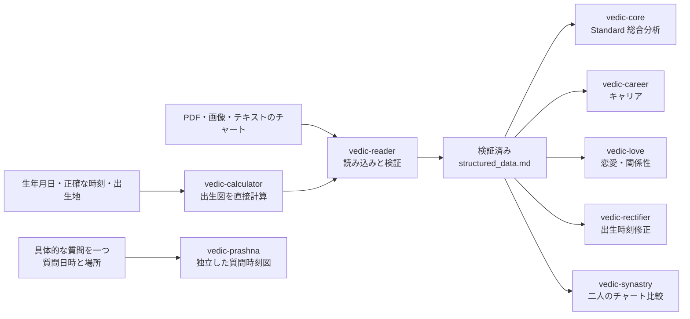

<p align="center">
  <h1 align="center">🔱 Vedic Astro Skills v8.0</h1>
  <p align="center"><strong>出生情報から出生図を直接計算し、そのまま総合分析へ</strong></p>
  <p align="center">
    <sub>从出生信息直接排盘，进入完整吠陀占星分析<br>
    Calculate a Vedic chart from birth details and continue directly to full analysis</sub>
  </p>
  <p align="center">
    <a href="CHANGELOG.md"></a>
    <a href="#python-環境"></a>
    <a href="#-8つの-skill"></a>
    <a href="#-ライセンスと利用範囲"></a>
  </p>
</p>

<p align="center">
  🌐 <a href="README.md"><strong>简体中文</strong></a> ·
  <a href="README.en.md"><strong>English documentation</strong></a> ·
  <strong>日本語ドキュメント</strong>
</p>

---

> **8つの専門 Skill が連携し、出生情報からの直接計算、データ検証、総合出生図分析、キャリア、恋愛・関係性、出生時刻修正、二人のチャート比較、Prashna までを扱います。**
>
> Codex、Claude Code、および Claude Skill 形式を読み込むあらゆるクライアント（Antigravity、各種の中国製 agent など）に対応します。PDF、画像、テキストのチャートは任意の読み込み方法であり、必須ではありません。

<details>
<summary><strong>📖 目次を開く</strong></summary>

- [この Skill Suite でできること](#-この-skill-suite-でできること)
- [全体ワークフロー](#-全体ワークフロー)
- [8つの Skill](#-8つの-skill)
- [各 Skill の詳細](#-各-skill-の詳細)
- [技術構成とデータ整合性](#-技術構成とデータ整合性)
- [インストール](#-インストール)
- [クイックスタート](#-クイックスタート)
- [推奨 Codex パッチ](#-推奨-codex-パッチ)
- [多言語対応](#-多言語対応)
- [リポジトリ構成と更新](#-リポジトリ構成と更新)
- [バージョン履歴](#-バージョン履歴)
- [ライセンスと利用範囲](#-ライセンスと利用範囲)

</details>

## ✨ この Skill Suite でできること

これは、作成済みの PDF を解説するだけのプロンプト集ではありません。基本の入口は
出生情報です。

1. 生年月日、正確な出生時刻、出生地を入力します。
2. `vedic-calculator` が完全な出生図を計算します。
3. `vedic-reader` がデータを検証し、出生時刻のリスク評価と事前検証を行います。
4. 共通データである `structured_data.md` を生成します。
5. 総合出生図分析、キャリア、恋愛・関係性、出生時刻修正、二人のチャート比較へ進みます。

JHora などの PDF、スクリーンショット、テキスト出力も読み込めます。これらは計算結果との
照合に利用できますが、必須ではありません。**出生情報から直接計算し、そのまま完全分析へ
進めること**が中心の使い方です。

主な機能：

- 外部のチャートサイトや事前作成 PDF を必要としない出生図計算
- 本命系の各 Skill が共有する、検証済みの標準データ契約
- P1-P12 惑星監査、分割図による照合、12ハウス診断、10の人生領域、技術付録
- キャリア、恋愛・関係性、出生時刻修正、4種類の関係フレームに対応する Synastry
- 完全な Vimshottari MD/AD/PD 時系列と出生時刻入力の安定性監査
- 本命分析と混在しない独立したプラシュナ（質問時刻図）
- 中国語・英語・日本語の会話、入力、質問票、レポート、Q&A、HTML 外枠
- 内容基準 `skills/` と Claude Code、Codex の2配布面に対する整合性チェック

## 🔄 全体ワークフロー



本命系の Skill は、検証済みの `structured_data.md` を共通利用します。
`vedic-prashna` は独自の `structured_prashna.md` と出力ディレクトリを使い、
本命 Dasha、分割図、SAV を自動的に質問時刻図の判断へ混ぜません。

## 🧩 8つの Skill

| Skill | 主な入力 | 役割 | 主な成果物 |
|---|---|---|---|
| [`vedic-calculator`](skills/vedic-calculator/SKILL.md) | 生年月日、正確な時刻、出生地 | 完全な出生図と時系列を計算 | `structured_data.md` |
| [`vedic-reader`](skills/vedic-reader/SKILL.md) | 計算済みデータ、PDF、画像、テキスト | 抽出、標準化、16項目の検証、事前検証、ルーティング | 検証済み `structured_data.md` |
| [`vedic-core`](skills/vedic-core/SKILL.md) | 検証済み本命データ | Standard の完全出生図監査と10領域分析 | 段階別 Markdown、技術付録、HTML |
| [`vedic-career`](skills/vedic-career/SKILL.md) | 検証済み本命データ | キャリアの方向性、役割適性、D9/D10、時期 | 人物像・戦略・リスクのレポート |
| [`vedic-love`](skills/vedic-love/SKILL.md) | 検証済み本命データ | 恋愛・関係性のパターン、維持力、時期 | 関係パターン・時期・ガイダンスのレポート |
| [`vedic-rectifier`](skills/vedic-rectifier/SKILL.md) | 不確かな出生時刻、出来事、特性 | 候補時刻を出来事と構造証拠で比較 | 修正監査と結論レポート |
| [`vedic-synastry`](skills/vedic-synastry/SKILL.md) | 一人につき一つの検証済み出生図 | 中立スキャン、方向別作用、維持力、共通時期 | `synastry_data.md` と段階別レポート |
| [`vedic-prashna`](skills/vedic-prashna/SKILL.md) | 一つの質問、質問日時、場所 | 独立した質問時刻図と監査可能な判定根拠表 | `structured_prashna.md` と判定書 |

8つをまとめてインストールすることを推奨します。実行時には現在の依頼に必要な Skill
だけが選択され、すべてのワークフローが同時に読み込まれるわけではありません。

## 🔍 各 Skill の詳細

<details>
<summary><strong>🧮 vedic-calculator：出生情報から直接計算</strong></summary>

`vedic-calculator` は本命ワークフローの計算基盤です。生年月日、正確な時刻、緯度経度、
IANA タイムゾーンから、標準データ `structured_data.md` を作成します。

主な出力：

- ラグナ（Lagna／上昇点）と9惑星の経度、ハウス、逆行、ナクシャトラ、Pada
- 7K 主表と 8K 参考表の Chara Karaka
- D1、D9、D10、D4、D5 を含む D1～D60 の15分割図
- Shadbala、Ishta/Kashta Phala、SAV、BAV
- ハウス支配星、Compound Dignity、Graha Drishti、燃焼、月相、AL、UL
- 9 MD、81 AD、729 PD の完全なヴィムショッタリ・ダシャー
- 現在のトランジット、Sade Sati、ダブルトランジット、分割図境界の敏感性

計算時には MD/AD/PD をすべて生成・検証します。下流では `dasha_query.py` を使って
必要な PD だけを読み込みます。729行を常にモデルへ渡すことや、都合のよい候補だけを
選択的に詳しく見ることを防ぎます。

ユーザーが明示的に希望した場合は、小火人向けの `xiaohuo-person-v1` テキスト資料も
出力できます。この資料は canonical な出生図データを置き換えません。

</details>

<details>
<summary><strong>📖 vedic-reader：読み込み、整合性検証、事前検証</strong></summary>

`vedic-reader` には二つの入口があります。

- Calc ルート：calculator が作成した `structured_data.md` を読み込みます。
- ファイルルート：PDF、画像、テキストから出生情報を抽出し、calculator で標準データを作成します。

PDF や画像は、抽出と照合のために使い、計算済みデータを無条件に上書きしません。
Shadbala は常に calc の基準値を残します。同じ出生時刻の有効な JHora PDF がある場合だけ、
行ごとに比較し、差異を明示します。

Reader は SAV/BAV 定数、惑星の完全性、Rahu-Ketu の対向、逆行、燃焼、惑星戦争、
Ayanamsa、Nakshatra、Chara Karaka、MD/AD/PD の連続性、D9 公式、分割図の node 規則を
含む16項目の検証体系を実行します。出生時刻の記録元の信頼性と、分割図の数学的安定性は
別々に評価します。

検証後は、信号の事前スキャン、Yoga スキャン、事前検証を行い、Core または各テーマ Skill
へルーティングします。

</details>

<details>
<summary><strong>🔬 vedic-core：Standard の完全出生図分析</strong></summary>

公開リポジトリには Standard の `vedic-core` が含まれます。一つの長い文章を一度に
生成するのではなく、監査可能な成果物を段階的に作ります。

1. 出生図の中心テーマと P1-P12 惑星監査
2. Yoga 事前スキャン、PAC 総合判定、Rahu/Ketu の node 監査
3. D9 の詳細監査と D10、D4、D5 による照合
4. 12ハウス、Parivartana、Badhaka の診断
5. Dasha の振り返り、Yoga の発動確認、10の人生領域
6. P1-P12 パラメータ、分割図、検証、時系列の技術付録
7. レポートのパッケージ化と完了後の Q&A

技術ファイルにはパラメータ、反対材料、監査履歴を残し、10の人生領域は顧客向けの
主要本文として整理します。どちらか一方で他方を代用しません。

</details>

<details>
<summary><strong>💼 vedic-career：キャリアの方向性、役割適性、時期</strong></summary>

キャリア分析は、職場での生態的位置、才能と Yoga、D9 詳細監査、全体統合の4段階です。
D1、D9、D10、Dasha を組み合わせ、「何が得意か」「どの役割に向くか」「どの環境で力を
発揮しやすいか」「現在どのキャリア段階にいるか」を分けて判断します。最終成果物は、
単なる職業名の一覧ではなく、人物像、戦略、リスクをまとめます。

</details>

<details>
<summary><strong>💘 vedic-love：恋愛・関係性のパターンと時期</strong></summary>

まず出生図から、感情面で必要とするもの、惹かれ方、関係を築き維持する力を確認します。
次に Dasha と関係指標から時期の窓を特定し、最後にトランジットで窓の性質を確認します。
第5・第7ハウス、Venus、Moon、PK/DK、UL、D9 などを使い、支持材料と反対材料の両方を
結論に残します。

</details>

<details>
<summary><strong>📐 vedic-rectifier：出生時刻修正</strong></summary>

出生時刻が曖昧、大まか、または記録にずれがある可能性がある場合に使います。標準入口では、
5件以上の主要な出来事と個人特性、Dasha 時系列、D1/D9/D10 の切替、分単位の天文計算を
組み合わせます。

最初に報告時刻の情報源と意味を確認して探索区間を決め、残るすべての候補を比較します。
特定の候補だけを検証する方法ではありません。原始スコア首位、現在の最良推定、確認済み層、
確信度を分けて表示し、未決着のケースへ根拠のない分単位精度を与えません。

</details>

<details>
<summary><strong>💞 vedic-synastry：二人のチャート比較</strong></summary>

一人につき一つの検証済み `structured_data.md` が必要です。最初に現実の関係種類を前提と
しない中立スキャンを行います。その後、性質判断だけで止める、一般的な詳細分析を行う、
または romantic、business、friendship、family の4フレームから選ぶことができます。

双方の関係維持力、Ashtakoota（月宿相性のスクリーニング）、双方向のハウス作用と
Graha Drishti、共通する時期を分析します。最終的には、感情的安全、惹かれ方、修復力、
長期維持、現実的協力、現在の時期の6次元で示します。単一の相性パーセントへ圧縮せず、
出生図から現実の関係種類を逆算しません。

</details>

<details>
<summary><strong>🔮 vedic-prashna：独立した質問時刻図</strong></summary>

一つの観察可能な結果に絞った質問を受け取り、その質問が確定した正確な日時と場所で
プラシュナ（質問時刻図）を作ります。既定の標準層は *Shatpanchasika* を基礎とし、
KN Rao／Bharatiya Vidya Bhavan の実践との互換性を確認しています。判定根拠表を示した上で、
「成立・実現の方向」「保留・未決着」「現時点では不成立の方向」のいずれかを判断します。

現在の標準層は、本番利用できる精度の出来事日付を提供しません。Moon に接触がないだけで
自動的に不成立とも判定しません。Tajika と KP 1–249 は既定で無効の独立オプションで、
ファイルと結論権限が分離され、標準層と投票しません。出版例と境界テストが完了するまでは、
いずれも実験候補として明示されます。

</details>

## 🧮 技術構成とデータ整合性

### 計算構成

| 項目 | 現在の実装 | 説明 |
|---|---|---|
| Ayanamsa | True Chitrapaksha (`TRUE_CITRA`) | Lahiri 系の固定基準 |
| Node | Mean Node | 計算と検証で共通の基準 |
| 天文計算 | pysweph / Swiss Ephemeris | 惑星、Lagna、時刻依存計算 |
| SAV/BAV | PyJHora ネイティブ | サイン値とハウス対応 |
| Vimshottari Dasha | PyJHora の MD/AD/PD | `[start,end)` の連続区間 |
| Shadbala | PyJHora + 9項目の修正 | Ishta/Kashta Phala を含む |
| 分割図 | PyJHora ネイティブ | D1～D60 の15図、主要図は安定性を別途監査 |
| Dignity | dashaflow + 高揚・自室・減衰の優先判定 | Compound Relationship を出力 |
| Chara Karaka | 7K 主表 + 8K 参考 | 7K を KN Rao の主要基準として使用 |
| エラー処理 | fail-fast | 依存不足や重大エラー時に既知の誤った代替計算へ戻らない |

### 標準データ契約

本命ワークフローは `structured_data.md` を共通インターフェースとして使用します。

- 出生情報、タイムゾーン、Ayanamsa、データ参照元
- 惑星、Lagna、Nakshatra、Chara Karaka
- Shadbala、SAV/BAV、dignity、Graha Drishti、ハウス支配星、AL、UL
- D1 と主要分割図、Vargottama、分割図の確信度宣言
- 完全な MD/AD/PD 時系列、現在のトランジット、検証結果

言語を変更しても、標準ファイル名、schema 見出し、JSON key、CLI flag、証拠ラベル、
score、phase state、report lineage は変更しません。

### 検証と精度の境界

- Reader は16項目の数学・構造検証をすべて実行します。
- Calc 出力は 9 MD、81 AD、729 PD を持ち、各層に欠落や重複がないことを確認します。
- D1、D9、D10、D4、D5 の Lagna を、出生時刻の不確実区間内で1分ごとに再計算し、
  安定、境界敏感、未監査を別々に表示します。
- 出生時刻記録の信頼性と、分割図の数学的安定性を分けて報告します。
- Shadbala は calc 基準を保持し、同一時刻の有効な JHora PDF がある場合だけ行単位で照合します。
- 月単位の時期判断には PD が必要です。AD や年数比率から月精度を作りません。
- 重大な依存または検証エラー時は、見た目だけ整った結果ではなく修復手順を返します。

v6.1 で記録された回帰サンプル：

| 項目 | 記録済み結果 |
|---|---|
| BAV | 84/84 小項目が一致 |
| SAV | 12/12 サインが一致 |
| Dasha | 27/27 の検証境界が2日以内 |
| Shadbala | 2つのテスト出生図で総誤差 0.52 rupas。未修正 PyJHora の 3.75 から減少 |

これは追跡可能なリポジトリ内の回帰記録であり、すべての場所、時刻境界、出生図に対する
一律の精度パーセントではありません。そのため、以前の監査継続が難しい「精度 >97%」という
表現は復元していません。詳細は [CHANGELOG.md](CHANGELOG.md) を参照してください。

## 📦 インストール

リポジトリを取得し、8つの Skill をまとめてインストールします。

```bash
git clone https://github.com/CNWU16/vedic-astro-skills.git
```

### コマンド一つでインストール（推奨）

```bash
python vedic-astro-skills/skill_sync.py install
```

`~/.claude/skills/`（Claude Code）と `~/.gemini/config/skills/`（Antigravity）へ自動で
インストールします。`--dry-run` を付けると差分の確認のみで書き込みません。本スクリプトは
**git 操作を一切行わず**、上書きと追加のみで削除はしません。リポジトリに無いローカル
ファイルは `[ORPHAN]` として一覧表示され、確認のうえ `--prune` を付けた場合のみ削除します。

Codex は次節の手動コピーをご利用ください。`~/.codex/skills/` は自動インストールの対象外で、
別途 `codex-patch/` の導入も必要です。

### Codex

```bash
cp -r vedic-astro-skills/codex/skills/vedic-* ~/.codex/skills/
```

`codex/skills/` には8つのネイティブ Skill エンジンが含まれます。推奨される Codex
実行環境を利用する場合は、独立した [`codex-patch`](codex-patch/README.ja.md) も導入します。
既存のグローバル `AGENTS.md` を上書きせず、安全に統合してください。

### Claude Code

```bash
cp -r vedic-astro-skills/claude-code/skills/vedic-* ~/.claude/skills/
```

Claude Code は各 Skill の `SKILL.md` を唯一のワークフロー真源として使います。古い
`.claude/commands` の完全コピーは維持していません。

### Claude Skill 形式を読み込むその他のクライアント

Antigravity や各種の中国製 agent が該当します。`vedic-astro-skills/skills/` にある8つの
`vedic-*` フォルダを、そのクライアントが実際に使用する Skill ディレクトリへコピーして
ください。`skills/` は公開内容の基準であり、プラットフォーム固有のメタデータを含みません。

### Python 環境

Python **3.8～3.13** に対応します。pysweph は C 拡張で、対応するビルド済み wheel が
ないため、現在 Python 3.14 は計算環境として使用できません。

最初に環境診断を実行します。

```bash
python3 vedic-astro-skills/skills/vedic-calculator/scripts/check_env.py
```

修復が必要と表示された場合：

```bash
python3 vedic-astro-skills/skills/vedic-calculator/scripts/setup_env.py
```

Codex または Claude Code では、インストール先にある同名スクリプトへパスを変更できます。
`setup_env.py` は互換 Python を選択し、分離環境を作成し、10個の依存パッケージを正しい順序で
導入し、ephemeris ファイルを補い、最小 SAV 計算を検証します。

> `pip install -r requirements.txt` を直接実行しないでください。`dashaflow` は停止済みの
> `pyswisseph` を依存として宣言していますが、この Suite は `pysweph` を使います。
> 自動スクリプトが導入順序と `--no-deps` で競合を処理します。

## ⚡ クイックスタート

### 出生情報から始める

```text
この出生情報からヴェーダ占星術の出生図を作成し、総合分析まで進めてください。
生年月日：1990-01-01
出生時刻：08:00
出生地：東京都、日本
レポートは日本語で書いてください。
```

計算と Reader の検証後：

```text
Standard 版で完全な出生図分析を行ってください。
```

### 既存チャートから始める

JHora PDF、画像、テキストを添付します。

```text
このヴェーダ占星術チャートを読み込んで検証し、Standard の総合分析へ進めてください。
```

### キャリアと恋愛・関係性

```text
キャリアの方向性、役割適性、今後数年間の時期を分析してください。
```

```text
恋愛・関係性のパターン、感情面で必要とするもの、関係の時期を分析してください。
```

### 出生時刻修正

```text
出生時刻が正確でない可能性があります。出生時刻修正を開始し、必要な主要な出来事を
教えてください。
```

### 二人のチャート比較

二人それぞれの出生情報、または検証済み `structured_data.md` を用意します。

```text
この二人の出生図を比較してください。まず中立的な関係性スキャンを行い、その後で
関係フレームを選ばせてください。
```

### Prashna

```text
この具体的な質問をプラシュナで判断してください。
質問：提出した申請は承認されますか。
質問日時：2026-08-15 14:32:10
質問場所：東京都、日本
```

Prashna は一つの観察可能な結果に絞ります。対象、目的、行動が変われば新しい質問です。
望む答えを得るために同じ質問を繰り返し起図しません。

## 🛡 推奨 Codex パッチ

Skill 本体は単独でも実行できます。`codex-patch` は Codex 向けの実行互換レイヤーであり、
`SKILL.md` を変更したり、8つの Skill を置き換えたりしません。主な役割：

- phase の順序と必要な参照ファイルの条件付き読み込み
- ユーザーの既知情報と出生図由来証拠の分離
- Standard/Pro の選択と report lineage の混在防止
- 完全レポート、通常 Q&A、Blind QA、分析者編集、HTML の成果物ルーティング
- 出生時刻修正における候補決着、反対材料監査、質問設計
- 人生領域と Q&A の顧客向け文章の読みやすさ

インストール手順の概要：

1. 先に8つの `vedic-*` Skill を導入します。
2. `codex-patch/AGENTS.md` の `# Vedic Skill Suite Execution Router` から始まる完全な
   セクションを、実際に有効なグローバル指示へ統合します。
3. 11個の `codex-patch/vedic_*.md` を有効な `CODEX_HOME` 直下へコピーします。
4. 新しい Codex タスクを開始し、ルーターが読み込まれたことを確認します。

```bash
cp -r vedic-astro-skills/codex-patch/vedic_*.md ~/.codex/
```

既存の `~/.codex/AGENTS.md` を上書きしないでください。独自の `CODEX_HOME` や
`AGENTS.override.md` がある場合は、実際に有効なパスを確認します。完全なガイド：

- [日本語ガイド](codex-patch/README.ja.md)
- [English guide](codex-patch/README.en.md)
- [中文说明](codex-patch/README.md)

`vedic-core-pro` を別途導入している場合も、Pro 専用の二つ目のパッチは不要です。同じパッチが
Standard/Pro の選択と lineage 分離を担当します。この公開リポジトリには Standard の
`vedic-core` が標準で含まれます。

## 🌐 多言語対応

中国語・英語・日本語は、同じ計算、証拠、score、phase、ファイル契約を共有します。
アルゴリズム本文を三つの翻訳ワークフローへ複製していません。

| 層 | 中国語 | English | 日本語 |
|---|---|---|---|
| 検出と会話 | ネイティブ対応 | ネイティブ対応 | ネイティブ対応 |
| 入力、質問票、進捗 | ユーザー言語 | ユーザー言語 | ユーザー言語 |
| レポートと Q&A | 中国語本文 | English client prose | 日本語の顧客向け文章 |
| ローカライズリソース | 共通既定テンプレート | 共通 language contract | Skill ごとの `resources/ja-*.md` |
| HTML 外枠 | `--lang cn` | `--lang en` | `--lang ja` |

日本語リソースは、用語、`です・ます` 調、入力文、質問票、レポートラベルだけを制御します。
計算、証拠、phase、判断は変更しません。`report_builder.py` は3言語の HTML 外枠に対応します。

```bash
python report_builder.py <report-folder> --name "Name" --lang en
python report_builder.py <report-folder> --name "山田" --lang ja
```

実行途中で言語が変わっても、既存データと report lineage は維持し、その後の顧客向け内容だけを
新しい言語へ切り替えます。

## 🗂 リポジトリ構成と更新

```text
vedic-astro-skills/
├── README.md / README.en.md / README.ja.md
├── CHANGELOG.md
├── skills/                    # 公開内容の基準（真源）
│   ├── vedic-calculator/
│   ├── vedic-reader/
│   ├── vedic-core/
│   ├── vedic-career/
│   ├── vedic-love/
│   ├── vedic-rectifier/
│   ├── vedic-synastry/
│   └── vedic-prashna/
├── claude-code/skills/        # 基準とファイル単位で一致
├── codex/skills/              # agents/openai.yaml のみ追加
├── codex-patch/               # 推奨 Codex 実行レイヤー
├── scripts/check_skill_parity.py
└── assets/
```

`skills/` が公開内容の基準です。Claude Code はファイル単位で一致し、Codex は各 Skill に
`agents/openai.yaml` を一つだけ追加できます。同期後に実行します。

```bash
python3 scripts/check_skill_parity.py
```

ローカル版を更新する場合は、リポジトリで `git pull` を行い、8つの Skill をまとめて再コピーします。
Codex ではルーターと11モジュールも一つのパッケージとして更新し、その後に新しいタスクを開始します。

## 📋 バージョン履歴

| バージョン | 主な変更 |
|---|---|
| Unreleased | 英語・日本語の実行契約、Skill ごとの日本語リソース、3言語 HTML、Codex Patch、Prashna 安全再構成 |
| v8.0 | 独立した `vedic-prashna` 質問時刻図を追加 |
| v7.0 | `vedic-synastry` と6次元関係マトリクスを追加 |
| v6.1 | fail-fast、Shadbala 修正、全 Antardasha、精度回帰を追加 |
| v6.0 | 出生情報から直接計算する `vedic-calculator` を追加 |
| v5.x | 段階実行、段階保存、動的レポート生成 |
| v4.x | 二系統読み込み、時刻精度ルーティング、16項目検証体系 |
| v3.0 | Core、Career、Love、Reader、Rectifier の基本構成を確立 |

完全な記録は [CHANGELOG.md](CHANGELOG.md) を参照してください。過去の節は当時の動作を示します。
現在の動作は最新の Unreleased と各 `SKILL.md` を真源とします。

## ⚖ ライセンスと利用範囲

このリポジトリは、伝統的なヴェーダ占星術の構造化計算・分析ワークフローを実装しています。
文化的学習、研究、個人の自己理解を目的とし、医療、法律、金融、その他の安全上重要な専門判断を
代替するものではありません。

- コードは [AGPL-3.0](LICENSE) で提供されます。
- `SKILL.md`、prompt template、`resources/`、`references/` の指示ファイルには、追加の
  [商用利用制限](COMMERCIAL_NOTICE) があります。
- 個人・非商用での利用、学習、変更は可能です。
- 第三者向けの有料 API、ホスト型サービス、商用製品へ指示ファイルを利用するには、書面による
  許可が必要です。

## ☕ プロジェクトを支援する

この Skill Suite が役立った場合は、WeChat Pay または Alipay で継続的なメンテナンスを
支援できます。

<p align="center">
  
  &nbsp;&nbsp;&nbsp;&nbsp;
  
</p>
