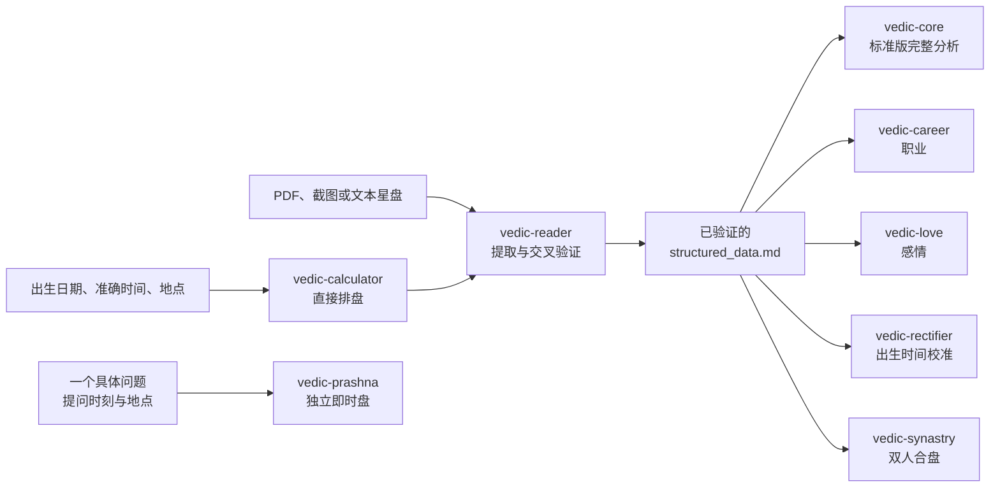

<p align="center">
  <h1 align="center">🔱 Vedic Astro Skills v8.0</h1>
  <p align="center"><strong>从出生信息直接排盘，进入完整吠陀占星分析</strong></p>
  <p align="center">
    <sub>Calculate a Vedic chart from birth details and continue directly to full analysis<br>
    出生情報から出生図を直接計算し、そのまま総合分析へ</sub>
  </p>
  <p align="center">
    <a href="CHANGELOG.md"></a>
    <a href="#python-环境"></a>
    <a href="#-八个-skill"></a>
    <a href="#-许可与使用边界"></a>
  </p>
</p>

<p align="center">
  🌐 <strong>简体中文</strong> ·
  <a href="README.en.md"><strong>English documentation</strong></a> ·
  <a href="README.ja.md"><strong>日本語ドキュメント</strong></a>
</p>

---

> **八个专精 Skill 协同工作：从出生信息直接排盘，到数据校验、完整本命分析、职业、感情、出生时间校准、双人合盘与 Prashna。**
>
> 兼容 Codex、Claude Code，以及任何读取 Claude Skill 格式的客户端（Antigravity、各类国产 agent 等）；PDF、截图与文本星盘是可选导入方式，不是使用前提。

<details>
<summary><strong>📖 展开目录</strong></summary>

- [这套 Skill 能做什么](#-这套-skill-能做什么)
- [整体工作流](#-整体工作流)
- [八个 Skill](#-八个-skill)
- [各模块详细说明](#-各模块详细说明)
- [技术架构与数据完整性](#-技术架构与数据完整性)
- [安装](#-安装)
- [快速开始](#-快速开始)
- [Codex 推荐补丁](#-codex-推荐补丁)
- [多语言机制](#-多语言机制)
- [仓库结构与更新](#-仓库结构与更新)
- [版本历史](#-版本历史)
- [许可与使用边界](#-许可与使用边界)

</details>

## ✨ 这套 Skill 能做什么

这不是一个只负责解释现成 PDF 的提示词集合。多数用户可以直接从出生信息开始：

1. 提供出生日期、准确时间和地点；
2. `vedic-calculator` 计算完整吠陀星盘；
3. `vedic-reader` 校验数据、评估时间风险并完成验前事流程；
4. 生成统一的 `structured_data.md`；
5. 继续进入完整本命分析、职业、感情、出生时间校准或双人合盘。

如果已经有 JHora 或其他占星软件导出的 PDF、截图或文本，也可以直接读取并与计算
结果交叉验证。但文件不是前置条件，**从出生信息直接排盘并进入完整分析**才是主入口。

主要能力包括：

- 从出生信息直接计算星盘，不依赖外部排盘网站或预先生成的 PDF；
- 统一的结构化数据契约，供全部本命分析模块复用；
- P1-P12 行星审计、分盘交叉、十二宫诊断、十大人生板块和技术附录；
- 职业、关系时机、出生时间校准和四类关系框架的双人合盘；
- 完整 Vimshottari MD/AD/PD 时间线与输入时间稳定性审计；
- 独立的 Prashna 提问时刻盘，不与本命分析混跑；
- 中文、英文、日文的对话、采集、问卷、报告、Q&A 与 HTML 外壳；
- 真源 `skills/` 与 Codex、Claude Code 两个发行面保持内容一致。

## 🔄 整体工作流



本命链路共享同一份经过验证的 `structured_data.md`。`vedic-prashna` 使用独立的
`structured_prashna.md` 和判读目录，不需要本命盘，也不会自动调用本命 Dasha、
分盘或 SAV 给提问盘下结论。

## 🧩 八个 Skill

| Skill | 主要输入 | 核心职责 | 主要产物 |
|---|---|---|---|
| [`vedic-calculator`](skills/vedic-calculator/SKILL.md) | 出生日期、准确时间、地点 | 计算完整吠陀星盘与时间线 | `structured_data.md` |
| [`vedic-reader`](skills/vedic-reader/SKILL.md) | 计算结果，或 PDF、截图、文本 | 提取、标准化、16 条校验、验前事与路由 | 已验证的 `structured_data.md` |
| [`vedic-core`](skills/vedic-core/SKILL.md) | 已验证的本命数据 | 标准版完整本命审计与十大板块 | 分阶段 Markdown、技术附录、HTML |
| [`vedic-career`](skills/vedic-career/SKILL.md) | 已验证的本命数据 | 职业生态位、天赋格局、D9/D10 与时机 | 职业画像、策略、风险报告 |
| [`vedic-love`](skills/vedic-love/SKILL.md) | 已验证的本命数据 | 关系模式、情感需求、关系承载与时间窗口 | 原盘、时机、建议报告 |
| [`vedic-rectifier`](skills/vedic-rectifier/SKILL.md) | 不确定出生时间、重大事件、个人特质 | 扫描候选时间并用事件与结构证据校准 | 校准过程与结论报告 |
| [`vedic-synastry`](skills/vedic-synastry/SKILL.md) | 两个人各一份已验证本命数据 | 中性平扫、双向叠盘、关系承载与共同时间 | `synastry_data.md` 与分层报告 |
| [`vedic-prashna`](skills/vedic-prashna/SKILL.md) | 一个具体问题、提问时刻、地点 | 建立独立提问时刻盘并按规则账本判断 | `structured_prashna.md` 与判读单 |

建议完整安装八个 Skill。实际运行时按任务调用相应模块，不会把所有工作流同时加载。

## 🔍 各模块详细说明

<details>
<summary><strong>🧮 vedic-calculator：从出生信息直接排盘</strong></summary>

`vedic-calculator` 是本命链路的计算基座。它使用出生日期、准确时间、经纬度与
IANA 时区，生成下游模块统一消费的 `structured_data.md`。

主要输出：

- Lagna、九颗 Graha、度数、宫位、逆行状态与 Nakshatra/Pada；
- 7K 主表与 8K 参考的 Chara Karaka；
- D1、D9、D10、D4、D5 及额外分盘，共 15 张 D1～D60；
- Shadbala、Ishta/Kashta Phala、SAV、BAV；
- 宫主、Compound Dignity、Graha Drishti、燃烧、月相、AL 与 UL；
- 9 段 MD、81 段 AD、729 段 PD 的完整 Vimshottari 时间线；
- 当前过运、Sade Sati、双过运与分盘边界敏感性。

计算器一次性生成并校验全部 MD/AD/PD。下游通过 `dasha_query.py` 按需要渐进读取，
避免把 729 行 PD 默认塞入模型上下文，也避免只对偏爱的候选选择性下钻。

如果用户明确需要把排盘资料带到小火人，可在排盘后说：

```text
整理一段可复制给小火人的资料。
```

该分支生成 `xiaohuo-person-v1` 纯文字资料卡，不改变 canonical
`structured_data.md`。

</details>

<details>
<summary><strong>📖 vedic-reader：读盘、校验与验前事</strong></summary>

`vedic-reader` 同时支持两条入口：

- Calc 路径：直接读取计算器生成的 `structured_data.md`；
- 文件路径：从 PDF、截图或文本提取出生信息，再让 calculator 生成 canonical 数据。

在文件路径中，PDF/截图主要用于提取和交叉验证，不会任意覆盖计算结果。Shadbala
始终保留 calc 基准；当存在同一出生时间生成的有效 JHora PDF 时，才逐行对照并
显示可用的 PDF 值，差异会明确标注。

Reader 执行完整的 16 条校验体系，包括 SAV/BAV 常量、行星完整性、Rahu-Ketu
对冲、逆行、燃烧、行星战争、Ayanamsa、Nakshatra、Chara Karaka、MD/AD/PD
连续性、D9 公式与分盘节点规则。它还会根据出生时间来源和不确定区间评估分盘
稳定性，而不是把“出生证”或“计算成功”直接等同于所有分盘都可靠。

数据验证后，Reader 执行信号预扫、Yoga 扫描与验前事流程，再路由到 Core 或专题
分析模块。

</details>

<details>
<summary><strong>🔬 vedic-core：标准版完整本命分析</strong></summary>

公开仓库包含标准版 `vedic-core`。它不是一次性生成一篇泛化长文，而是按阶段形成
可回查的分析产物：

1. 身份概览与 P1-P12 行星审计；
2. 格局预扫、PAC 联合判定与 Rahu/Ketu 节点审计；
3. D9 逐星深审，并交叉 D10、D4、D5；
4. 十二宫完整诊断、Parivartana 与 Badhaka 审计；
5. Dasha 回顾、Yoga 激活验证与十大人生板块；
6. P1-P12 参数、分盘、校验和时间线技术附录；
7. 报告打包与完成后的 Q&A。

前面的技术文件保留参数、正反证据与审计轨迹，十大板块负责形成可直接阅读的客户
正文。两层不会互相替代。

</details>

<details>
<summary><strong>💼 vedic-career：职业方向与时机</strong></summary>

职业模块按四个阶段执行：职场生态位扫描、天赋格局扫描、D9 深度审计、全维合成。
它联合 D1、D9、D10 与 Dasha，区分“擅长什么”“适合什么角色”“怎样的组织环境
更能发挥”以及“当前处于哪种职业阶段”。最终产物分为画像与叙事、战略决策、风险
与箴言，而不是只列职业名称。

</details>

<details>
<summary><strong>💘 vedic-love：关系模式与恋爱时机</strong></summary>

关系模块先分析原盘的情感模式、需求与承载能力，再通过 Dasha 和相关关系点位锁定
时间窗口，最后结合过运判断窗口性质。它使用 5/7 宫、Venus、Moon、PK/DK、UL、
D9 等吠陀指标，并要求支持证据与制约证据同时进入结论。

</details>

<details>
<summary><strong>📐 vedic-rectifier：出生时间校准</strong></summary>

校准模块适合具体时间不确定、只有大致时间或怀疑记录有偏差的情况。标准入口需要
五件或更多重大人生事件，并结合个人特质、Dasha 时间线、D1/D9/D10 等分盘切换和
逐分钟天文计算。

它先核实时间来源与时刻语义，再确定扫描区间；随后比较全部候选，而不是只验证一个
喜欢的时间。结论区分原始分领先者、当前最佳估计、已确认层级与时间置信度。临界或
欠定情况会进入盘外验证，不会用虚假的分钟精度强行收口。

</details>

<details>
<summary><strong>💞 vedic-synastry：双人合盘</strong></summary>

合盘需要双方各一份已验证的 `structured_data.md`。流程先做不预设现实关系类型的
中性性质平扫，再由用户选择：只看性质、通用深析，或进入 romantic、business、
friendship、family 四种专属框架。

它分析双方独立承载、Ashtakoota 月宿筛查、双向落宫与 Graha Drishti、关系时机
共振，并以六维矩阵呈现情绪安全、吸引、沟通修复、长期承载、现实协作和当前时机。
系统不提供一个掩盖结构差异的“匹配度百分比”，也不会从盘面反推现实关系类型。

</details>

<details>
<summary><strong>🔮 vedic-prashna：独立提问时刻盘</strong></summary>

Prashna 只回答一个可观察结果明确的问题，使用问题正式形成时的准确时间和地点起盘。
默认标准层以 *Shatpanchasika* 为主文本，并通过 KN Rao/Bharatiya Vidya Bhavan
实践兼容性筛选，以可显示的规则账本给出“成／悬／不成”判断。

当前标准层不提供生产级事件日期，也不会把 Moon 无接触自动写成“不成”。Tajika
接触层和 KP 1–249 是默认关闭、文件和结论权限均隔离的可选栈；它们不会与标准层
拼票。Tajika 与 KP 在出版例盘和边界测试闭合前继续明确标为实验候选。

</details>

## 🧮 技术架构与数据完整性

### 计算架构

| 项目 | 当前实现 | 说明 |
|---|---|---|
| Ayanamsa | True Chitrapaksha (`TRUE_CITRA`) | Lahiri 系；固定基准 |
| Node | Mean Node | 各验证规则按同一口径执行 |
| 天文核心 | pysweph / Swiss Ephemeris | 行星、Lagna 与时间相关计算 |
| SAV/BAV | PyJHora 原生算法 | 输出星座值与宫位映射 |
| Vimshottari Dasha | PyJHora 原生 MD/AD/PD | 统一使用 `[start,end)` 连续区间 |
| Shadbala | PyJHora + 9 项针对性修正 | 包含 Ishta/Kashta Phala |
| 分盘 | PyJHora 原生 | 15 张 D1～D60；关键分盘另做输入稳定性审计 |
| Dignity | dashaflow + 旺/入庙/陷前置判断 | 输出 Compound Relationship |
| Chara Karaka | 7K 主表 + 8K 参考 | 7K 作为 KN Rao 主口径 |
| 容错 | fail-fast | 缺依赖或关键校验失败时停止，不回退到已知错误算法 |

### Canonical 数据契约

本命工作流以 `structured_data.md` 为统一接口。它包含：

- 出生元信息、时区、Ayanamsa 和数据来源；
- 行星、Lagna、Nakshatra、Chara Karaka；
- Shadbala、SAV/BAV、Dignity、Graha Drishti、宫主、AL/UL；
- D1 与关键分盘、Vargottama 和分盘可信度声明；
- 完整 MD/AD/PD 时间线、当前过运与校验结果。

语言切换不会翻译或改写 canonical 文件名、schema 标题、JSON key、CLI 参数、
证据标签、评分、阶段状态或报告谱系。

### 校验与精度边界

- Reader 的完整规则集执行 16 条数学与结构校验；
- Calc 路径必须得到 9 MD、81 AD、729 PD，并验证各层无断裂、无重叠；
- D1、D9、D10、D4、D5 在出生时间不确定区间内逐分钟重算 Lagna，分别标记稳定、
  边界敏感或未审计；
- 输入来源可靠度和分盘数学稳定度分开报告；
- Shadbala 先保存 calc 基准，有同一出生时间的有效 JHora PDF 时才逐行交叉验证；
- 需要月份级判断时必须读取 PD，不能用 AD 或按年比例近似制造月级精度；
- 关键依赖或校验失败时直接停止并给出修复路径，不输出看似完整的错误结果。

仓库在 v6.1 中记录过以下回归样本：

| 项目 | 已记录结果 |
|---|---|
| BAV | 84/84 小项匹配 |
| SAV | 12/12 星座匹配 |
| Dasha | 27/27 边界偏差不超过 2 天 |
| Shadbala | 两张测试盘总误差 0.52 rupas，相比原始 PyJHora 的 3.75 明显降低 |

这些是可回查的仓库回归记录，不是对所有地点、时间边界和盘型宣称一个笼统准确率。
因此本版没有恢复旧 README 中无法持续审计的“准确率 >97%”说法。详细历史见
[CHANGELOG.md](CHANGELOG.md)。

## 📦 安装

建议先克隆仓库，再一次安装全部八个 Skill：

```bash
git clone https://github.com/CNWU16/vedic-astro-skills.git
```

### Codex

```bash
cp -r vedic-astro-skills/codex/skills/vedic-* ~/.codex/skills/
```

`codex/skills/` 是八个原生 Skill 引擎。为了获得本仓库推荐的 Codex 执行效果，
还应安装独立的 [`codex-patch`](codex-patch/README.md)。补丁安装涉及安全合并
`AGENTS.md`，不要直接覆盖已有全局规则，完整步骤见后文。

### Claude Code

```bash
cp -r vedic-astro-skills/claude-code/skills/vedic-* ~/.claude/skills/
```

Claude Code 以各 Skill 的 `SKILL.md` 为唯一工作流来源，不再维护旧式
`.claude/commands` 全量副本。

### 其它读取 Claude Skill 格式的客户端

包括 Antigravity 以及各类国产 agent：把 `vedic-astro-skills/skills/` 下的八个
`vedic-*` 文件夹复制到该客户端实际使用的 Skill 目录即可。`skills/` 是发布内容基准，
不含任何平台专属元数据。

### Python 环境

支持 Python **3.8～3.13**。当前不支持 Python 3.14 运行计算环境，因为 pysweph
是 C 扩展，尚无对应的预编译 wheel。

首次使用先运行诊断：

```bash
python3 vedic-astro-skills/skills/vedic-calculator/scripts/check_env.py
```

如果诊断要求修复环境，再运行：

```bash
python3 vedic-astro-skills/skills/vedic-calculator/scripts/setup_env.py
```

Codex 或 Claude Code 用户也可以把路径换成对应安装目录中的同名脚本。`setup_env.py`
会选择兼容的 Python、创建隔离环境、按正确顺序安装十项依赖、补齐星历文件并验证
最小 SAV 计算。

> 不要直接执行 `pip install -r requirements.txt`。`dashaflow` 声明依赖已经停更的
> `pyswisseph`，而当前实现使用 `pysweph`；自动脚本通过正确安装顺序和
> `--no-deps` 处理冲突。

## ⚡ 快速开始

### 从出生信息开始

```text
帮我用吠陀占星直接排盘并做完整分析。
出生日期：1990-01-01
出生时间：08:00
出生地点：北京市，中国
报告使用中文。
```

计算与 Reader 验证完成后，可以继续说：

```text
用标准版做完整本命分析。
```

### 读取已有星盘

上传 JHora PDF、截图或文本，然后说：

```text
读取并验证这份星盘，完成后继续标准版完整分析。
```

### 职业与感情

```text
分析我的职业方向、适合的角色和接下来几年的职业时机。
```

```text
分析我的关系模式、情感需求和可能的关系时间窗口。
```

### 出生时间校准

```text
我的出生时间可能不准。请按出生时间校准流程，先告诉我需要准备哪些重大事件。
```

### 双人合盘

提供双方的出生信息或两份已验证的 `structured_data.md`：

```text
比较这两张星盘。先做中性性质平扫，再让我选择关系框架。
```

### Prashna 即时盘

```text
请用 Prashna 判断这个具体问题。
问题：我提交的这个申请能否获批？
提问时间：2026-08-15 14:32:10
提问地点：上海市，中国
```

Prashna 的问题必须对应一个可观察结果。新对象、新目标或新行动属于新问题，不会
为了获得更满意的结果反复重起同一张盘。

### 指定英文或日文

```text
Calculate my Vedic chart from these birth details and write the full report in English.
```

```text
この出生情報からヴェーダ占星術の出生図を作成し、総合鑑定を日本語で書いてください。
```

## 🛡 Codex 推荐补丁

Skill 本体可以独立运行。`codex-patch` 是面向 Codex 的执行兼容层，不改动任何
`SKILL.md`，也不替代八个 Skill。它主要处理：

- 阶段纪律与必要参考文件的按需读取；
- 用户已知经历与盘面证据的隔离；
- Standard/Pro 报告谱系选择与防混合；
- 完整报告、普通 Q&A、盲问、分析师编辑和 HTML 的产物路由；
- 出生时间校准中的候选结算、反证审计与问题设计；
- 客户正文、十大板块与 QA 的可读性规则。

安装步骤：

1. 先安装八个 `vedic-*` Skill；
2. 将 `codex-patch/AGENTS.md` 中从 `# Vedic Skill Suite Execution Router`
   开始的完整段落安全合并到实际生效的 Codex 全局指令；
3. 将 11 个 `codex-patch/vedic_*.md` 文件复制到实际 `CODEX_HOME` 根目录；
4. 新建 Codex 任务，确认新规则已经加载。

```bash
cp -r vedic-astro-skills/codex-patch/vedic_*.md ~/.codex/
```

不要用仓库的 `AGENTS.md` 直接覆盖已有的 `~/.codex/AGENTS.md`。如果设置了
`CODEX_HOME`，或者存在会覆盖全局规则的 `AGENTS.override.md`，应以实际生效路径
为准。完整安装、更新和卸载说明：

- [中文说明](codex-patch/README.md)
- [English guide](codex-patch/README.en.md)
- [日本語ガイド](codex-patch/README.ja.md)

如果用户另外安装了 `vedic-core-pro`，不需要第二份补丁；同一补丁会负责 Standard
与 Pro 的选择和报告谱系隔离。公开仓库默认提供的核心引擎是标准版 `vedic-core`。

## 🌐 多语言机制

三个语言版本共享同一套计算、证据、评分、阶段与文件契约，不复制三份算法正文。

| 层级 | 中文 | English | 日本語 |
|---|---|---|---|
| 触发与对话 | 原生支持 | 原生支持 | 原生支持 |
| 信息采集、问卷、进度 | 跟随用户语言 | 跟随用户语言 | 跟随用户语言 |
| 报告与 Q&A | 中文客户端正文 | English client prose | 日本語の顧客向け文章 |
| 本地化资源 | 共享默认模板 | 共享语言契约 | 每个 Skill 独立 `resources/ja-*.md` |
| HTML 外壳 | `--lang cn` | `--lang en` | `--lang ja` |

日文本地化资源只固定术语、敬体、采集措辞、问卷与报告标签，不改变计算、阶段、
证据或结论。`report_builder.py` 支持 `cn/en/ja` 三种 HTML 外壳：

```bash
python report_builder.py <report-folder> --name "Name" --lang en
python report_builder.py <report-folder> --name "山田" --lang ja
```

语言在运行中切换时，既有数据和报告谱系保持不变，只切换之后的客户端内容。

## 🗂 仓库结构与更新

```text
vedic-astro-skills/
├── README.md / README.en.md / README.ja.md
├── CHANGELOG.md
├── skills/                    # 发布内容基准（真源）
│   ├── vedic-calculator/
│   ├── vedic-reader/
│   ├── vedic-core/
│   ├── vedic-career/
│   ├── vedic-love/
│   ├── vedic-rectifier/
│   ├── vedic-synastry/
│   └── vedic-prashna/
├── claude-code/skills/        # 与基准逐文件一致
├── codex/skills/              # 额外包含 agents/openai.yaml
├── codex-patch/               # Codex 推荐执行兼容层
├── scripts/check_skill_parity.py
└── assets/
```

`skills/` 是发布内容基准。Claude Code 发行版必须逐文件一致；Codex 只
允许每个 Skill 额外包含一个 `agents/openai.yaml`。修改或同步后运行：

```bash
python3 scripts/check_skill_parity.py
```

更新本机安装时，先在仓库执行 `git pull`，再整体复制八个 Skill。Codex 用户还应把
路由器和 11 个模块作为同一个补丁版本更新，避免新旧模块混用，并在更新后新建任务。

## 📋 版本历史

| 版本 | 主要变化 |
|---|---|
| Unreleased | 英文与日文运行契约、日文逐 Skill 本地化资源、三语 HTML、Codex Patch、Prashna 安全重构 |
| v8.0 | 新增独立 `vedic-prashna` 提问时刻盘 |
| v7.0 | 新增 `vedic-synastry` 双人合盘与六维矩阵 |
| v6.1 | fail-fast、Shadbala 修正、完整 Antardasha 与精度回归 |
| v6.0 | 上线原生 `vedic-calculator`，实现出生信息直排 |
| v5.x | 分阶段执行、渐进写入与动态报告打包 |
| v4.x | 双通道读取、时间精度联动与 16 条校验体系 |
| v3.0 | Core、Career、Love、Reader、Rectifier 五模块架构成形 |

完整记录和历史口径变更见 [CHANGELOG.md](CHANGELOG.md)。较早版本的说明不一定代表
当前行为，以上方 Unreleased 和当前 `SKILL.md` 为准。

## ⚖ 许可与使用边界

本仓库实现传统吠陀占星的结构化计算与分析工作流，适用于文化学习、研究和个人探索。
它不能替代医疗、法律、金融或其他安全关键领域的专业判断。

- 代码采用 [AGPL-3.0](LICENSE)；
- `SKILL.md`、提示模板和 `resources/`、`references/` 下的指令文件另有
  [商用限制](COMMERCIAL_NOTICE)；
- 个人、非商业使用可以自由学习和修改；
- 未经书面授权，不得把指令文件用于向第三方提供收费 API、网页服务或商业产品。

## ☕ 支持项目

如果这套 Skill 对你有帮助，可以通过微信或支付宝支持后续维护：

<p align="center">
  
  &nbsp;&nbsp;&nbsp;&nbsp;
  
</p>
